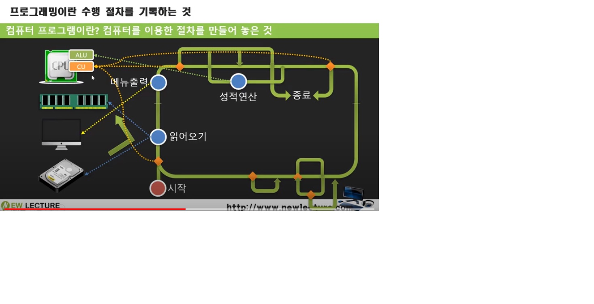

<h3>컴퓨터 프로그래밍을 하기 위한 사전지식</h3>

### 컴퓨터란?

중앙처리장치(CPU) - 산술/논리 연산, 흐름 제어 기능이 있고, 이 둘 중 흐름 제어 기능이 조금 더 중요하다 할 수 있다.(ex, 3+4를 1억번 연산 해야한다면 우리는 그 숫자에 질릴것이다. 흐름 제어는 그 것을 반복적으로 처리하는 기능이고 CPU가 가진 가장 큰 능력이라 할 수 있다.)

주기억장치(Memory) - 임시 저장소(Data), 임시 저장소이기 때문에 CPU가 계산한 결과를 날려먹을 수 있다. 그래서 영구적으로 저장할 수 있는 장치가 필요한데 그 장치가 다양한 입/출장치이다.

다양한 입/출장치(HDD/ODD/...) - 데이터 소스/영구 저장소, cd, usb, 하드디스크, 네트워크를 통한 다른 컴퓨터에 저장 등 다양한 입, 출력 장치이다.

*  콘솔이라는 단어가 있는데 사람이 기계를 이용, 조종 할 수 있는 장치라는 의미가 담겨있고, 그 콘솔이 바로 모니터와 키보드이다. 이 모니터와 키보드는 가장 기본이 되는 입/출력 장치이다.

* 입/출력 장치의 조합에 따라서 컴퓨터의 종류, 용도가 달라진다.

* (주기억장치가 어떤 데이터를 담고있고, 그 데이터를 꺼내서 중앙처리장치가 연산을 처리한다.)

---

### 프로그램이란?, 컴퓨터 프로그램이란?

<b>프로그램</b>이란 단어의 의미는 '순서', '목록', '예정', '계획표' 이며 말 그대로 __특정 일이나 작업을 수행하기 위한 절차의 순서를 말하는 것이다.__
보통 프로그램이라 하면 컴퓨터 프로그램만 생각하지만 프로그램에는 교육, 텔레비전, 라디오, 영화제 등등 여러가지 경우가 있다.

<b>컴퓨터 프로그램</b>은 일련의 작업을 특정 언어의 명령어를 이용하여 작업 순서에 맞게 나열한 파일이라고 생각하면 된다. 즉, 컴퓨터를 이용한 절차를 만들어 놓은 것이다.

---
<b>프로그래밍 준비(Ready Programming)</b>
프로그래밍이란 말 그대로 프로그램을 위해 진행되는 작업 자체를 말한다.

<b>문제분석</b>
프로그램하기 위한 문제가 주어지면 해당 문제의 정확한 분석이 요구 즉, 프로그램 하기 위해 필요한 자료와 작업의 절차는 어떻게 이루어지는가에 대한 이해도가 필요하다는 것이다.

<b>사용하는 언어에 대한 정확한 이해도</b>
프로그램을 하기 위해 문제 분석을 마쳤다면 코딩작업을 해야한다.

<b>컴파일러 명령 사용이 요구</b>
컴파일러란 프로그램으로 작성한 파일을 컴퓨터가 이해할 수 있는 언어로 변경하는 역할을 한다.

<b>컴파일이란?</b>
언어규칙에 맞게 적혀진 원본 파일을 기계어로 변환하는 작업을 말한다. 이때 언어규칙에 맞게 작성하지 않은 경우에는 에러가 표시

<b>프로그램 작성을 위해 사용하는 에디터의 사용법이 요구</b>

[출처](https://itcoolly.tistory.com/56?category=628522)

---

### 